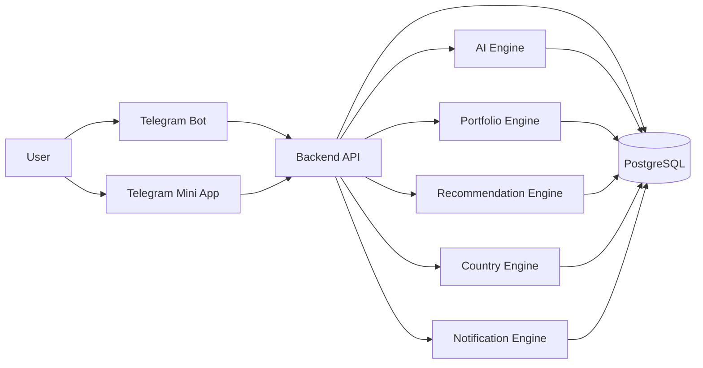

# Architecture Overview

Capital OS is split into modules because wealth management is inherently multi-domain and requires clear separation between user interaction, financial logic, AI reasoning, and data persistence. This modular structure makes the system easier to evolve, test, and maintain. It also allows the platform to support different countries, investment products, interfaces, and AI providers without creating a tightly coupled monolith.

# High-Level Architecture

Capital OS combines several coordinated subsystems:

- Telegram Bot: the primary conversational interface for alerts, reminders, coaching, and simple financial actions.
- Telegram Mini App: a lightweight interactive interface for dashboards, portfolio views, and guided workflows.
- Backend API: the central application layer that orchestrates business logic, permissions, and integrations.
- AI Engine: a domain-aware intelligence layer that provides planning, explanation, and recommendation capabilities.
- Portfolio Engine: manages portfolio state, allocations, balances, and investment tracking.
- Recommendation Engine: generates actionable suggestions based on goals, risk profile, and market context.
- Country Engine: provides localized rules, products, tax awareness, and jurisdiction-specific behavior.
- Notification Engine: sends updates, reminders, and alerts through Telegram and future channels.
- Database: stores users, portfolios, recommendations, country configurations, and system state.

# Backend Layers

The backend is organized into layered responsibilities:

- API: exposes HTTP endpoints and handles request validation, routing, and response formatting.
- Services: contain application use cases such as onboarding, planning, portfolio management, and recommendation orchestration.
- Repositories: abstract database access and isolate persistence logic from business rules.
- Models: represent core domain entities such as users, portfolios, goals, recommendations, and country profiles.
- Schemas: define request and response contracts using validated data structures.
- Core: contains shared infrastructure such as configuration, settings, security utilities, and cross-cutting concerns.

This layered design supports clean architecture principles, maintainability, and future growth.

# Frontend

The frontend is built with Next.js and follows a modern application structure centered around server-rendered pages, reusable UI components, and a clear separation between presentation and business logic. The frontend provides the web-based experience for dashboards, onboarding, reporting, and deeper analytical workflows, while Telegram remains the primary interaction layer for day-to-day engagement.

# AI Layer

The AI layer is designed as a provider abstraction so the system can work with multiple model vendors without hardcoding a single implementation. The application supports:

- OpenAI
- Claude
- Gemini
- Grok

The architecture uses a common interface for model access, allowing the system to swap providers based on availability, cost, performance, or regional constraints. No provider is treated as mandatory.

# Telegram Layer

Telegram is the primary user interface for Capital OS because it offers a convenient, always-available experience for communication, reminders, portfolio insights, and guided financial actions. Rich messages should be supported so the platform can send structured updates, cards, and interactive content. The Telegram Mini App is optional and acts as a richer companion experience for dashboards and more complex interactions.

# Database

PostgreSQL is the primary relational database for Capital OS. It stores structured business data such as users, accounts, portfolios, transactions, recommendations, and country-specific configurations. A future Redis cache layer may be introduced to improve performance for high-frequency access patterns, session state, and temporary computation results.

# Future Microservices

As the platform grows, the system may evolve into a set of focused microservices. Possible future services include:

- Authentication Service
- Portfolio Service
- Recommendation Service
- Notification Service
- AI Orchestration Service
- Country Rules Service

This decomposition would improve scalability, independent deployment, and specialized team ownership while preserving the core modular architecture of Capital OS.
